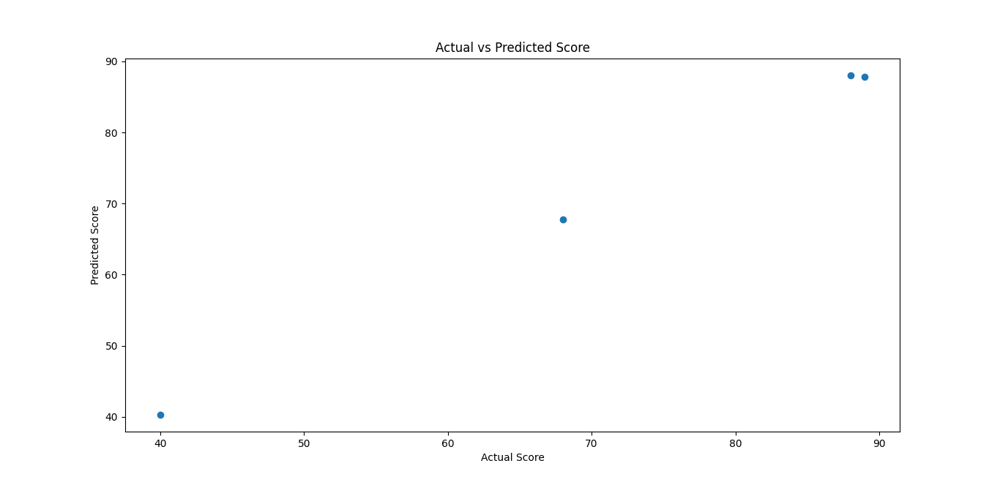
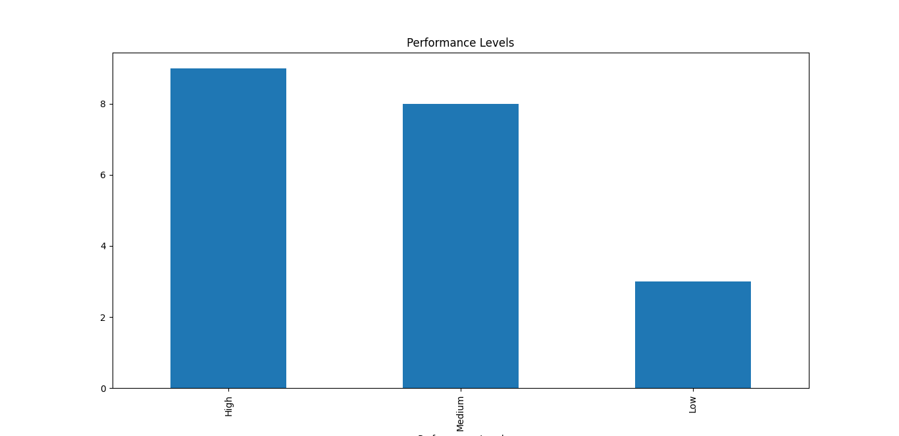
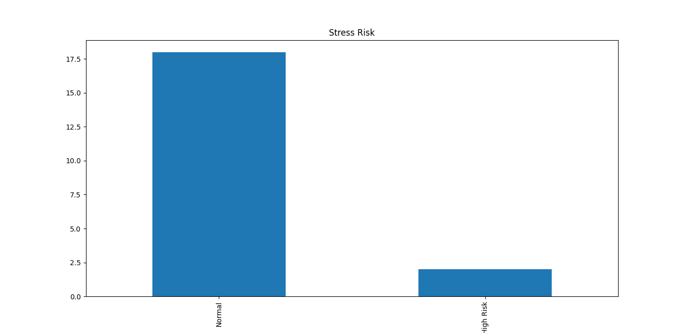

# 📊 Student Performance & Stress Prediction using Machine Learning

## 📌 Overview
This project focuses on analyzing student online learning behavior and predicting their academic performance and stress levels using Machine Learning techniques.

---

## 🎯 Objectives
- Understand patterns in student behavior
- Identify factors affecting stress and performance
- Build predictive models using ML algorithms

---

## 🛠️ Technologies Used
- Python
- Pandas
- NumPy
- Scikit-learn
- Matplotlib

---

## 📂 Dataset
The dataset contains student behavior data such as:
- Study time
- Screen time
- Attendance
- Assignment completion
- Stress indicators

---

## ⚙️ Features of the Project
- Data Cleaning & Preprocessing  
- Exploratory Data Analysis (EDA)  
- Visualization using graphs  
- Machine Learning model training  
- Prediction of performance & stress  

---

## 📈 Output
The model predicts:
- Student performance level  
- Stress level  

---

## 🚀 Future Improvements
- Improve model accuracy  
- Add real-time prediction system  
- Deploy as a web application  

---

## 👩‍💻 Author
Lasya Priya  
MCA Student – SRM Institute of Science & Technology  
Aspiring Data Science Researcher
## 📊 Visualizations

### 📈 Graph 1

### 📈 Graph 2

### 📈 Graph 3

